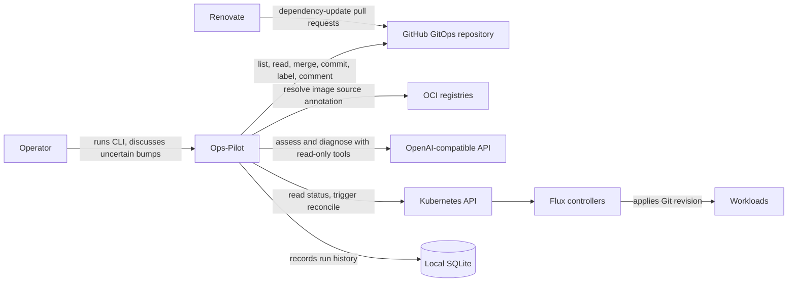
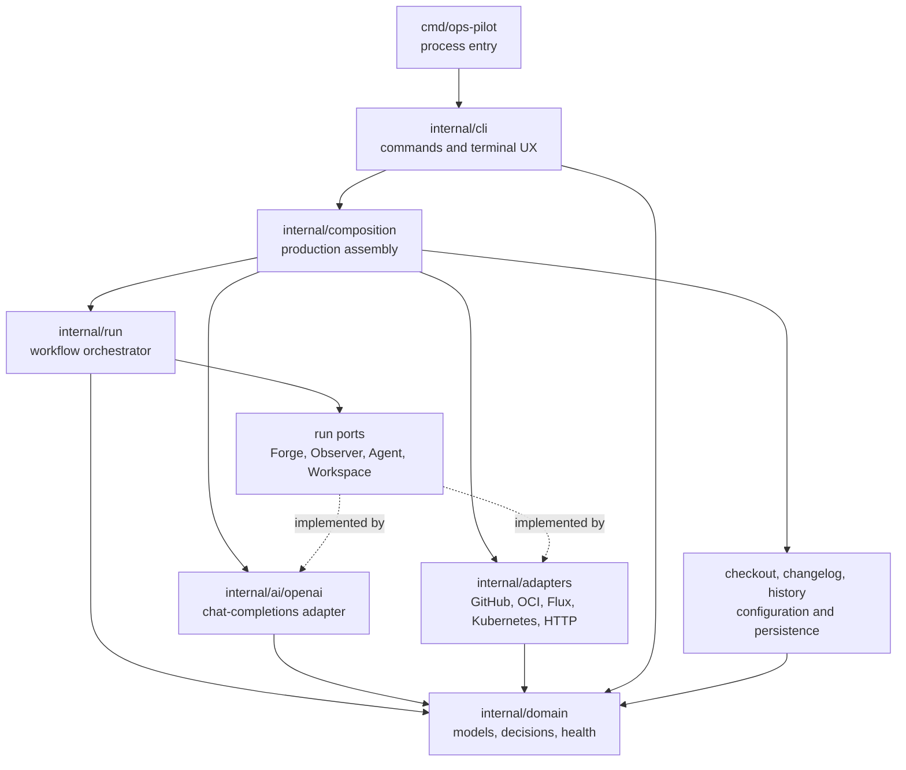
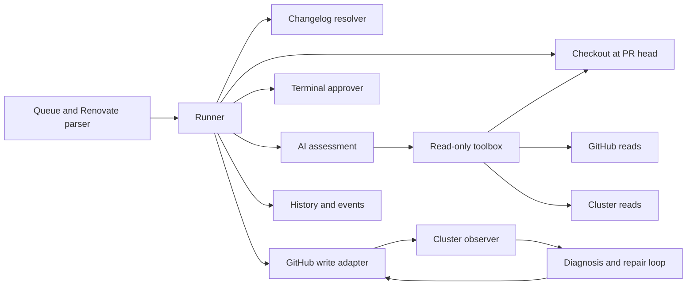
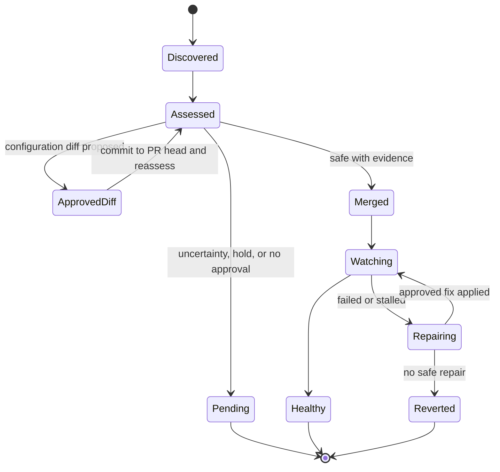

# Architecture Overview

Ops-Pilot is a single-process Go CLI. It keeps policy, state transitions, and
side effects separate: `internal/run` owns the dependency-update workflow,
`internal/domain` owns its vocabulary and invariants, and adapters perform I/O.
`internal/composition` is the sole production wiring point.

Read the [Project Overview](1.%20Project%20Overview.md) first, then the
[Workflow Overview](3.%20Workflow%20Overview.md) for the runtime sequence.
The [Deep Dive](4.%20Deep%20Dive/) documents individual subsystems.

## System context

The operator runs Ops-Pilot against one configured GitHub GitOps repository and
Kubernetes context. Renovate creates candidate pull requests. Ops-Pilot reads
release evidence and repository manifests, may consult an OpenAI-compatible
model, and writes only after the workflow's safety gates allow it.

### External boundaries

| Boundary | Role | Operations |
| --- | --- | --- |
| Operator terminal | Starts runs and resolves uncertainty | Streams AI-visible prose; approves exact diffs and reverts where required |
| GitHub | Pull-request and repository system of record | Lists/reads PRs and files; merges; commits approved fixes or reverts; comments, labels, closes superseded PRs |
| Renovate | Candidate producer | Opens dependency-update PRs consumed through GitHub; it is not called directly |
| OCI registry | Image metadata source | Reads `org.opencontainers.image.source` to discover upstream changelogs |
| OpenAI-compatible API | Judgment provider | Receives fenced evidence and may call a constrained, read-only toolbox before returning structured assessment or diagnosis |
| Kubernetes and Flux | Deployment observation and reconciliation | Reads Flux/workload state, events, and logs; annotates the configured Flux `GitRepository` to request reconciliation |
| SQLite | Run journal | Stores run and attempt records; lifecycle write failures stop the run, while an individual attempt-recording failure is logged and does not change that attempt's decision |

## Container and module architecture

There is one deployable container: the `ops-pilot` executable. Its internal
packages form layers rather than independent services. The dependency direction
is intentionally toward `domain`: adapters, runner, diagnostics, CLI, and AI
share domain models, while domain has no infrastructure dependency.

The current code graph reinforces this boundary: adapters have 82 graph edges
to domain, run 66, diagnostics 62, CLI 52, and AI 48. `composition.New` turns
those concrete pieces into `run.Dependencies`; it is the controlled seam between
construction and policy.

### Production wiring

[`internal/composition/composition.go`](../internal/composition/composition.go)
creates the production graph from validated configuration and environment
variables:

- GitHub adapter for the configured repository and token.
- Kubernetes dynamic, discovery, and typed clients; Flux and workload readers
  feed the cluster observer.
- OCI client and configured credentials for changelog image-source lookup.
- Local checkout rooted at the configured checkout directory.
- HTTP fetcher with a fixed host allowlist, changelog resolver, SQLite history,
  and event emitter.
- OpenAI-compatible agent with a toolbox bound to the checkout, GitHub, cluster,
  and allowlisted fetcher.
- `run.Runner`, supplied with ports plus options derived from configuration.

This is deliberately constructor wiring, not a service locator: tests can
replace each `run` port without initializing a network client or cluster.

## Core component graph

The runner processes candidates sequentially. The decision path is isolated
from recovery so a failed post-merge observation cannot be mistaken for a
pre-merge assessment.

### Responsibilities and seams

| Module | Responsibility | Primary collaborators |
| --- | --- | --- |
| `cmd/ops-pilot` | Starts the process and delegates argument handling | `cli` |
| `cli` | Cobra commands, configuration preparation, TTY detection, terminal chat/approvals, final reports | `composition`, `run`, `history`, `report` |
| `composition` | Builds production dependencies from configuration and environment references | adapters, `ai/openai`, `checkout`, `history`, `run` |
| `run` | Candidate queue, assessment gate, merge/watch, repair/revert, event emission | its ports, `domain`, `patch`, `renovate` parser |
| `domain` | Stable data types for PRs, updates, assessment verdicts, health snapshots, attempts, and errors | imported by all outer layers |
| `adapters/github` | Small GitHub REST boundary, safe retries, PR/file/commit/merge operations | `domain`, `retry` |
| `adapters/oci` and `changelog` | Resolve upstream changelog location and release range | registry HTTP, GitHub data, configured overrides |
| `adapters/flux`, `adapters/kubernetes`, `cluster` | Convert controller/workload state into health snapshots and watch outcomes | Kubernetes API, `domain` |
| `ai` and `ai/openai` | Judgment contract, fenced tool inputs, bounded tool-calling Chat Completions client, streaming prose | `domain`, toolbox |
| `checkout` and `patch` | Read PR-head manifests locally; validate and apply proposed unified diffs before GitHub commits | local Git, `domain` |
| `history`, `events`, `report` | Persist audit records, emit JSONL events, and render operator output | SQLite, `domain`, diagnostics |
| `diagnostics` | Structured logging, safe error rendering, and secret redaction | all operational layers |

## Architectural patterns

### Ports and adapters

`run` defines narrow interfaces for its Forge, Observer, Changelogs, Approver,
Workspace, Recorder, and Agent dependencies. The production implementations live
outside it; unit and end-to-end tests provide fakes. This keeps the workflow
testable while preventing GitHub, Kubernetes, or model client details from
shaping its decisions.

### Domain-centered layered design

`domain` contains data and validation rules such as valid assessment verdict
shapes, pull-request filtering, and health snapshots. It is intentionally not a
repository layer or an ORM. The outer packages translate external protocols into
those values and use them to advance the workflow.

### AI as a constrained judgment boundary

The AI is not granted write tools. Its toolbox can read the checked-out PR,
GitHub metadata, selected cluster diagnostics, and allowlisted web content.
Untrusted input is nonce-fenced before it reaches the model. The model returns
structured assessments or diagnoses; Go validates them and remains responsible
for every state transition and external write.

### Operational state machine

The runner starts from a PR-specific checkout, resolves evidence, assesses,
then either leaves the update pending or merges it. A successful merge is not
final until the cluster observer sees the expected revision and a stable healthy
state. Failures enter a bounded diagnosis/repair/revert loop.

## Key design decisions and trade-offs

1. **One PR at a time.** The run queue serializes merges and cluster watches.
   This reduces throughput but preserves a meaningful before/after health
   baseline and makes attribution possible.

2. **Local checkout is a read workspace, not a write path.** The agent reads
   manifests at the candidate PR head, while approved changes are committed
   through GitHub with an expected head SHA. This avoids local pushes and rejects
   stale/rebased PRs, at the cost of another API round trip.

3. **AI decides semantics; Go enforces authority.** The model may interpret
   changelogs and operator answers, but cannot merge, write files, or widen
   network access. Structured verdict validation, fences, exact-diff approval,
   path allowlists, and head checks make the safety boundary deterministic.

4. **Interactive clarification is a conversation, not a merge menu.** In a
   TTY the assessor streams visible prose and continues with user context until
   it reaches a structured conclusion. Non-interactive runs defer cases needing
   clarification, preserving unattended safety.

5. **History observes; it does not authorize.** SQLite and JSONL events record
   activity but are not workflow gates. Losing history damages auditability, not
   deployment safety.

6. **Health is comparative and revision-aware.** The observer captures a
   baseline, waits for Flux to fetch the merge revision, ignores pre-existing
   failures, and requires stability before success. That can delay a result, but
   avoids claiming a deployment failure caused by an unrelated existing problem.

7. **Repair is bounded and reversible.** A diagnosis may wait once, propose
   only allowlisted approved diffs, or declare the case unfixable. Exhaustion or
   refusal goes to an operator-visible revert path rather than repeated guesses.

## Module dependency rules

- `cmd` depends on `cli`; it has no deployment logic.
- `cli` initiates a run but does not implement assessment or repair policy.
- `composition` is the only production constructor for cross-cutting clients.
- `run` depends on interfaces and `domain`; it never imports a Kubernetes or
  GitHub protocol client as its operational dependency.
- Adapters translate external responses into domain values; they do not decide
  whether a bump is safe.
- The AI package can read evidence through its toolbox but cannot perform writes.
- `history`, `events`, and reporting must not control workflow decisions.

These rules keep the main safety question—whether a PR can advance—located in
one orchestration layer, with effects behind reviewable ports.
