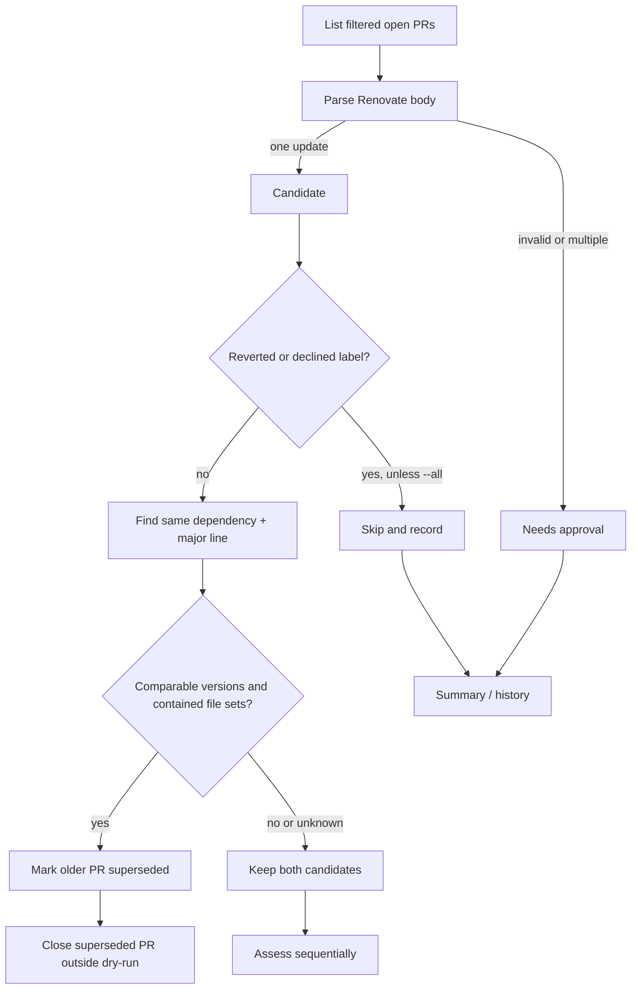
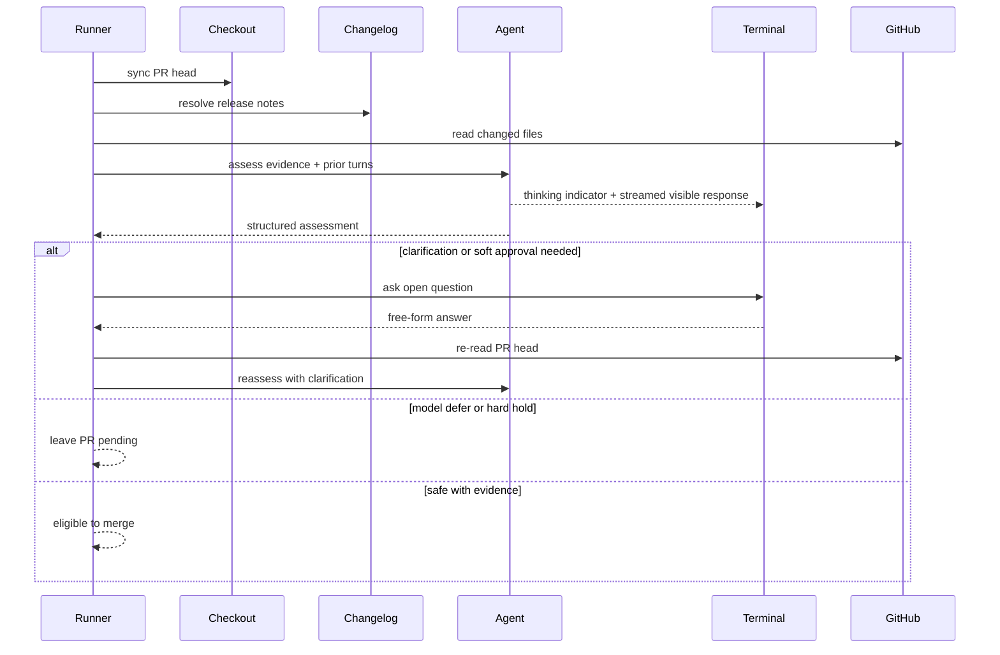
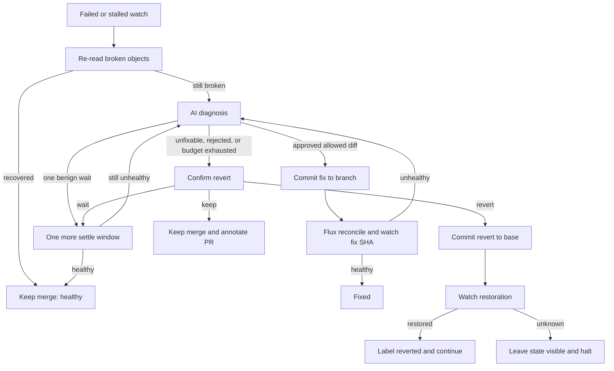
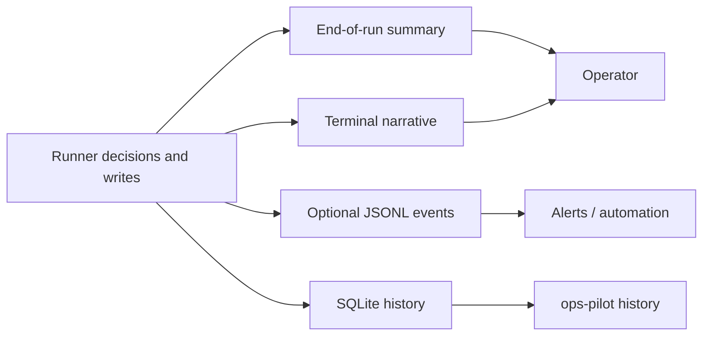

# Workflow Overview

Ops-Pilot is a sequential control loop for Renovate pull requests in a Flux GitOps repository. It keeps mechanical actions in Go and asks the AI only for assessment and diagnosis. A run processes one candidate at a time; if a merged revision cannot be observed, it halts rather than judging later candidates against an unknown cluster baseline.

For system boundaries and module ownership, see [Architecture Overview](2.%20Architecture%20Overview.md). The implementation-focused guides link from [Project Overview](1.%20Project%20Overview.md).

## CLI startup and composition

`ops-pilot run` loads and validates configuration, creates an event emitter, decides whether stdin is a usable terminal, and composes the production dependencies. Secrets are looked up by environment-variable name; they are never read from the configuration file. `--dry-run` prevents all external writes, while `--non-interactive` leaves approval-required pull requests pending.

```mermaid
sequenceDiagram
  participant Operator
  participant CLI as Cobra CLI
  participant Config
  participant Compose as composition.New
  participant GitHub
  participant Cluster as Flux/Kubernetes
  participant AI
  participant Runner

  Operator->>CLI: ops-pilot run [flags]
  CLI->>Config: prepare, load, validate
  CLI->>CLI: open optional JSONL events; detect TTY
  CLI->>Compose: config + options + approver
  Compose->>GitHub: create authenticated client
  Compose->>Cluster: build Flux and workload clients
  Compose->>AI: create tool-limited agent
  Compose->>Runner: inject ports and policy
  CLI->>Runner: Run(context)
```

Composition creates a local checkout only for the AI to read the PR head. Repository writes always use the GitHub API. The AI tools may read the checkout, GitHub/upstream data, selected HTTP hosts, and Kubernetes diagnostic data; they do not receive a repository-write capability.

## Discover, classify, and queue pull requests

The forge applies configured author, label, and base-branch filters while listing open pull requests. `run.Queue` parses each Renovate body into one dependency update. It records unusable bodies as approval-required rather than silently dropping them. Reverted and declined labels suppress candidates unless `--all` is set.

When two viable candidates target the same dependency major line, Ops-Pilot reads their changed paths. It closes the older candidate only when target versions are comparable and one changed-file set contains the other. A failed or empty file lookup proves nothing, so no PR is closed.



## Changelog resolution, assessment, and interactive discussion

Before assessment, the runner synchronizes the local checkout to the PR head. A checkout failure is retained as a safety hold and the checkout is repointed to the base branch where possible. The resolver chooses release information in this order: an explicit configured override, Renovate-provided release notes, release history for a named upstream, then an image `org.opencontainers.image.source` annotation. Missing or incomplete upstream evidence remains visible to the agent and can require approval.

The agent receives the dependency, PR, changed paths, resolved changelog, and prior clarification turns. It returns a structured assessment: safe, clarify, needs approval, defer, or a proposed configuration diff. Inputs and model output are fenced and scrubbed; a detected fence forgery is a non-negotiable hold.



The terminal is a chat, not a merge menu. Each assistant turn starts with a small thinking animation and streams safely redacted text in short batches; the operator replies at `you >`. The loop continues until the model reaches a safe, evidenced conclusion, defers, produces an approvable diff, encounters a hard hold, or input ends. Plain language such as `skip` is chat context for the model. Enter, `/skip`, `q`, `quit`, and `cancel` are local escape hatches that leave the PR pending immediately.

### Approved configuration diffs

The AI cannot write during discussion. A diff is handled by the existing fix path and is separately shown for exact approval. It must be an interactive, non-dry-run request; `fixes.allowedPaths` must be configured; and the PR head must be a writable branch in the configured repository. The patch is validated and committed with the assessed head SHA as an optimistic-concurrency precondition. The runner then refreshes the PR and reassesses the changed head from scratch; a diff never authorizes a merge by itself.

```mermaid
stateDiagram-v2
  [*] --> Assessing
  Assessing --> Pending: defer / hard hold / no evidence
  Assessing --> Discussing: clarification needed
  Discussing --> Assessing: answer; head unchanged
  Discussing --> Pending: local escape, EOF, or moved head
  Assessing --> DiffProposed: validated model diff
  DiffProposed --> Pending: dry-run, unsafe head, disallowed path, or declined
  DiffProposed --> CommitDiff: exact approval
  CommitDiff --> Pending: apply or refresh mismatch
  CommitDiff --> Assessing: refreshed PR head
  Assessing --> MergeEligible: safe + evidence
  MergeEligible --> [*]
  Pending --> [*]
```



## Merge, reconciliation, and watch

Just before merge, the runner captures a cluster health baseline and the current base-branch head, then reads the PR head again. GitHub receives the assessed SHA, so a rebase or race cannot merge unassessed content. After the merge it asks Flux to reconcile (a trigger failure is logged but does not hide the watch) and waits for the merged revision to reach the configured source.

If the merge call itself errors and a re-read of the pull request cannot say whether it landed, the merge answer was lost and the pull request could not be re-read: the run halts rather than treating an unconfirmed merge as nothing happened.

The watch passes only after the revision is present, no new attributable object failures remain, and the state has stayed stable for the configured hold. A persistent new failure returns `fail`; an unsettled window returns `stalled`. If Flux never fetched the revision, or health cannot be read, the result is unknown: the merge is left in place and the entire queue halts.

```mermaid
sequenceDiagram
  participant Runner
  participant Cluster
  participant GitHub
  participant Flux
  participant History
  participant Events

  Runner->>Cluster: snapshot baseline
  Runner->>GitHub: reread assessed PR head
  Runner->>GitHub: merge(expected head SHA)
  Runner->>Events: merged
  Runner->>Flux: request reconcile
  Runner->>Cluster: watch(baseline, merge SHA)
  alt stable and healthy
    Cluster-->>Runner: pass
    Runner->>History: record merged attempt
  else failed or stalled
    Cluster-->>Runner: outcome + affected objects
    Runner->>Runner: repair loop
  else unreadable or revision never fetched
    Cluster-->>Runner: error
    Runner->>Events: halted / failed
    Runner->>History: record halt; stop queue
  end
```

## Diagnose, fix, and revert

Failed and stalled watch outcomes enter the same repair loop. The agent receives only the affected objects, a bounded record of prior fixes, whether it already used the one benign wait, and Kubernetes/Flux diagnostics through its read-only tools. It can recommend one additional wait, an allowed-path diff, or an unfixable result.



Fixes share the patch validator and `fixes.allowedPaths` policy with pre-merge configuration changes. A rejected or non-applying fix does not undo the merge; the agent can correct it only within `watch.maxFixAttempts`. Before a revert, the runner re-reads the named unhealthy objects so a recovered rollout is not discarded. Reverts require an explicit terminal choice when interactive; an unanswerable prompt keeps the merge and halts rather than defaulting to a destructive action.

## History, events, summary, and state

The run has three complementary outputs. Terminal narration is for the present operator. The optional JSON Lines event stream is for monitoring while the run is active. SQLite history and the final summary answer what happened later. All stored prose is redacted and made safe for terminal replay.



`ops-pilot/reverted` and the configured declined label are the only durable controls that change a later run; `--all` intentionally reconsiders them. History is passive: deleting it loses audit data, not safety behavior. Superseded PR closure and GitHub comments/labels are evented as writes; an event-stream write failure is remembered and reported once, but cannot interrupt a run already changing the cluster.

## Fail-closed rules and error handling

The workflow favors leaving work pending or leaving a merge visible over guessing:

- Invalid Renovate metadata, no interactive operator, missing evidence, assessment failure, defer, or a moved PR head leaves the PR pending.
- Major bumps and dependency downgrades are held unless a safe assessment with evidence clears the relevant soft hold; a forged fence, checkout failure, unreadable changelog range, or disallowed write cannot be negotiated away.
- A pre-merge head read and GitHub's expected-head merge prevent merging content that was not assessed.
- No approved diff can write outside `fixes.allowedPaths`, to a fork, to a stale head, or during `--dry-run`.
- A cluster that cannot be observed after a merge or repair is not treated as healthy. Ops-Pilot records the condition, annotates the PR where possible, and halts subsequent work.
- The merge answer was lost and the pull request could not be re-read: Ops-Pilot cannot tell whether the change landed, so it annotates the PR where possible and halts rather than guessing.
- Secrets and terminal control text are scrubbed before output, streaming display, history, events, and summaries. The AI's diagnostic tools are read-only; all writes remain behind runner policy and explicit approval where required.

These constraints make interruption understandable: pending work can be retried from a new assessment, while an uncertain deployed state is never quietly processed past.
