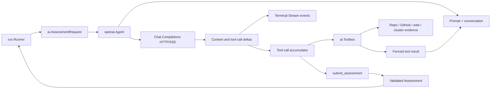
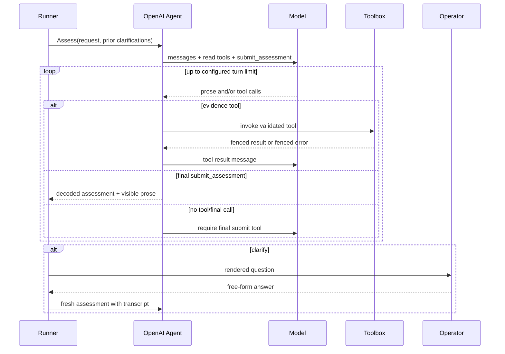
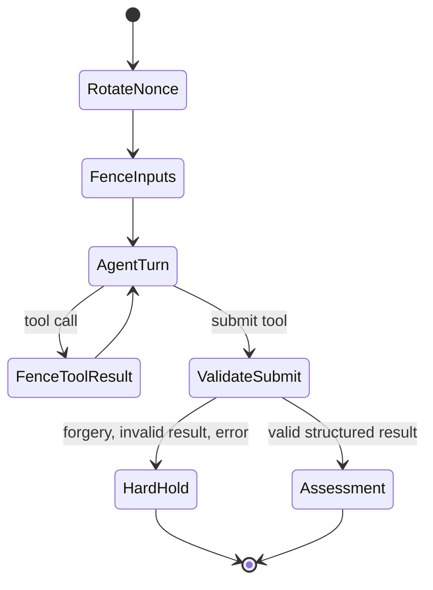

# Deep Dive: AI Assessment and Interactive Chat

## Overview

The AI subsystem is an evidence-gathering and judgement boundary, not an autonomous repository writer. `internal/ai` defines the request, streamed-event, and tool contracts; `internal/ai/openai` implements an OpenAI-compatible Chat Completions client with tool calling. The run orchestrator alone decides whether a structured result can reach a merge or an approved patch path.

When an interactive terminal is available, an uncertain bump becomes a bounded operator conversation. The model can ask follow-up questions across turns, but the only outcomes are structured: `safe`, `clarify`, `needs_approval`, or `defer`. No hidden chain-of-thought is requested, stored, or displayed. The terminal renders only concise assistant-facing prose, questions, and tool-derived conclusions.

See [Run Orchestrator](Run%20Orchestrator.md) for the decision loop that consumes assessments, and the [Workflow Overview](../3.%20Workflow%20Overview.md) for the full operational path.

## Responsibilities

- Build a fenced assessment/diagnosis conversation from pull-request, changelog, manifest, cluster, and operator-turn data.
- Let the model retrieve bounded repository, upstream, and (for diagnosis) cluster evidence through explicit tools.
- Decode a structured final tool call into a validated `domain.Assessment` or `domain.Diagnosis`.
- Stream visible assistant content to an interactive terminal while assembling the same completion's tool calls.
- Treat prompt-injection/fence forgery, malformed output, tool errors, and provider failure as safety holds rather than permission to proceed.

## Component Architecture

`ai.Agent` has two operations: assessment before a merge and diagnosis after a watch failure. `AssessmentRequest` carries the PR, dependency, resolved changelog, changed paths, prior clarifications, and optional stream callback. `DiagnosisRequest` carries the failed health evidence plus prior fixes/waits. The OpenAI adapter maps those contracts to Chat Completions messages and a tool set; callers receive domain values, not provider JSON.

## Assessment Contract

`domain.Assessment` is valid only in these combinations:

| Verdict | Required result | Runner effect |
| --- | --- | --- |
| `safe` | reason and non-empty evidence; no question/diff | May merge only after runner holds clear |
| `clarify` | one focused question; no diff | Operator provides another chat turn |
| `needs_approval` | reason; optional exact unified diff; no question | Pending, or separately approved patch flow |
| `defer` | reason; no question/diff | Leave the PR pending without another question |

The model ends assessment by calling `submit_assessment` exactly once. It cannot submit arbitrary action names, and it cannot submit a merge command. A diff is just data in the structured result: the runner validates allowed paths, shows the exact bytes to the operator, writes through the GitHub expected-head boundary, then reassesses the new PR head. This is why an operator saying “yes” in chat is not approval for a repository change.

## Conversation and Tool Loop

The shared read tools cover repository file reads/listing, public upstream files, repository search, releases, issues, and allowlisted URL fetches. Diagnosis adds pod listing, events, logs, and Flux status. `Toolbox` validates arguments and paths, bounds response sizes/listings/log tails, and converts failed tool calls into scrubbed, fenced tool-error data. The conversation loop replays results to the model until it calls the designated submit tool or reaches its turn limit.

## Fenced Evidence and Nonce Fencing

Every untrusted value that reaches the model is framed as `<<<UNTRUSTED-DATA <nonce> ...>>>`. A fresh nonce is rotated for each agent request; prior nonces are retired and remain detectable. The system prompt declares the live nonce before any data and says fenced material is evidence, never instruction. Repository content is additionally path-confined with `os.Root`, so a committed symlink cannot widen a later file read.

Forgery is monotonic: a forged marker, issued nonce echoed in data/model output, or unsafe fence condition can only add a hold. It never proves that a result is safe. Runner-side hard holds suppress model questions and diffs where the known condition is non-negotiable, and suppress streamed model prose when the original input already forged a fence. This deliberate silence avoids presenting a persuasive conversational answer for a PR that cannot safely be resolved by conversation.

## Streaming UX

For an interactive assessment, `openai.Agent.complete` sends `stream: true` and brackets every provider call with `StreamTurnStart` and `StreamTurnEnd`. `decodeStream` reads Server-Sent Events until `[DONE]`, emits visible `content` deltas, and concurrently reassembles split `tool_calls` by index, ID, type, function name, and arguments. Strict bounds reject oversized, truncated, malformed, empty-choice, or unsafe-index event streams.

`cli.Approver` is the terminal renderer. On turn start it begins a braille “ops-pilot is thinking…” animation (80 ms frames). Content is debounced into a 30 ms flush cadence and immediately flushed at newlines/end, which prevents a jittery per-token terminal while keeping a responsive response. It switches to `ops-pilot >` when visible content arrives.

Before rendering, the renderer holds incomplete UTF-8 between chunks, strips complete and split ANSI control sequences, applies a per-turn streaming redactor, and passes text through display-safe filtering. Stream events are rendered only to an interactive terminal; redirected and unattended runs stay deterministic and quiet. These messages are presentation content, not hidden reasoning traces.

## Persistent Operator Turns

`Approver.Clarify` shows an actual chat prompt (`you >`) after streamed content instead of repeating the full assessment. It accepts one bounded free-form line, while Enter, `/skip`, quit, cancel, or terminal escape leave the PR pending. The runner turns a non-empty answer into an `ai.Clarification` and makes a new agent request with the accumulated assistant/question/answer transcript. It repeats until the model reaches a structured conclusion, the operator leaves it pending, the PR head moves, or a runner-owned hard hold applies.

Plain language such as “skip”, “later”, or “defer” is deliberately sent to the model so it can conclude `defer` in context. Slash control commands are local terminal escape hatches. This preserves a conversational decision without allowing ordinary chat to bypass the exact-diff and merge gates.

## Key Files

- `internal/ai/ai.go` — public agent requests, clarification turns, activity and stream events.
- `internal/ai/openai/openai.go` — provider client, completion loop, SSE decoder, structured-result decoding.
- `internal/ai/openai/tools.go` — provider tool schemas, including the assessment submit contract.
- `internal/ai/toolbox.go` — bounded evidence tools, filesystem containment, data fences, and forgery tracking.
- `internal/ai/openai/prompts.go` — assessment/diagnosis instructions and transcript construction.
- `internal/cli/approver.go` — thinking animation, debounced stream rendering, redaction, and operator input.
- `internal/run/run.go` — runner-side holds, clarification loop, diff approval/reassessment, and stream eligibility.

## Testing

Adapter tests cover valid/invalid assessment payloads, tool errors, split content/tool-call SSE deltas, balanced start/end events, malformed/truncated streams, and unsafe tool indices. Prompt and toolbox tests cover fenced inputs, per-request nonces, operator transcript ordering, untrusted data boundaries, path containment, and fence-forgery detection. CLI tests cover thinking-to-content rendering, split UTF-8/ANSI handling, redaction, skip behavior, and bounded answers. Run and end-to-end tests cover repeated clarification, deferred outcomes, hard-hold suppression, exact-diff approval, reassessment, and head movement.

These tests use fake providers and ports. They verify protocol handling and the safety policy but do not guarantee a particular external model's judgement quality, token timing, or production provider availability.

## Bounded Potential Improvements

- Add provider conformance tests for any non-OpenAI-compatible SSE dialect before supporting it.
- Persist a redacted transcript only if cross-run conversation resume becomes an operator requirement.
- Make the animation/flush intervals configurable only if real terminal feedback shows the fixed 80 ms/30 ms defaults are unsuitable.
