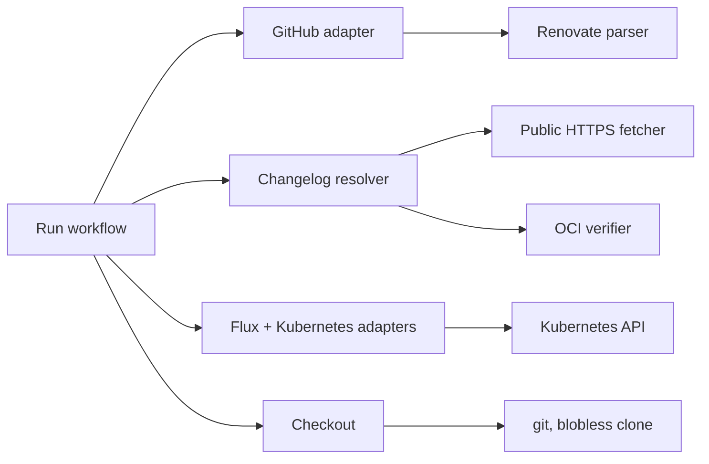

# Deep Dive: Adapters and Integrations

## Overview

Adapters keep remote systems at the edge of ops-pilot. The workflow speaks small internal ports; concrete clients enforce request, identity, path, retry, and credential rules before data reaches policy or an agent. The composition root binds these adapters for a run.

See [Architecture Overview](../2. Architecture Overview.md) and [Cluster Observation and Repair](Cluster Observation and Repair.md) for the consumers of these boundaries.

## Responsibilities

- Read and mutate only the configured GitHub repository, with optimistic head locks for merge and commit writes.
- Parse Renovate pull-request bodies into dependency updates without treating formatting as authority.
- Resolve and verify OCI image/chart metadata with bounded, authenticated registry access.
- Fetch public changelog content through an SSRF-resistant HTTPS client.
- Read Flux and Kubernetes status and keep a blobless local checkout solely for agent context.

## Integration map

## Key files

- `internal/adapters/github/*.go`: REST/GraphQL GitHub client, pull requests, merge, labels, comments, files, releases, and commits.
- `internal/adapters/renovate/parser.go`: Markdown-table parsing, release-note association, and semantic version/digest classification.
- `internal/adapters/oci/*.go`: reference parsing, safe transport/auth challenge handling, manifest traversal, and artifact verification.
- `internal/adapters/httpfetch/client.go`: public HTTPS fetcher for untrusted remote text.
- `internal/adapters/flux/*.go`, `internal/adapters/kubernetes/*.go`: cluster readers described in [Cluster Observation and Repair](Cluster Observation and Repair.md).
- `internal/checkout/checkout.go`: local read-only Git workspace.

## Implementation details

### GitHub: scoped reads and locked writes

`github.Client` is constructed with one repository reference and refuses malformed base URLs, traversal-like request paths, cross-origin redirects, oversized responses, and unbounded pagination. Generic transient transport/status retries are limited to reads, avoiding duplicate comments, labels, or mutations. Merge is the narrow exception: GitHub's temporary mergeability-pending response is retried against the same assessed head SHA, while other write failures are returned without replay.

Merge receives the assessed pull-request SHA. `CreateCommit` uses GitHub GraphQL `expectedHeadOid`, validates every repository-relative changed path, sorts changes, and verifies that the returned commit has exactly the expected parent. The expected head makes a concurrent PR update a safe failure rather than an accidental overwrite.

### Renovate input parsing

The Renovate parser extracts dependency rows and release-note blocks from a PR body, normalizes visible Markdown text, and classifies version changes as digest, patch, minor, major, or unknown. Ambiguous or malformed input stays a hold for later assessment rather than granting an unattended merge. Queueing uses parsed updates plus changed-file overlap to avoid parallel candidates that contend for the same GitOps configuration.

### OCI discovery and artifact verification

OCI references are canonicalized before use. The client disables proxy/redirect following, validates registry authority and credentials, pins safe dialing, caps bytes, descriptors, requests, and total call duration, and categorizes failure as unavailable, auth, trust-boundary, or integrity. `Resolve` obtains immutable image metadata and provenance; `VerifyArtifact` retrieves and hashes chart config/layer blobs, checking digest, media type, declared size, and aggregate limits.

### Public HTTP policy

`httpfetch.Client` accepts only HTTPS URLs without userinfo. It resolves every hop itself, rejects non-public addresses, dials the selected address directly, verifies the connected peer matches it, and re-validates redirect targets. Limits bound timeout, redirects, headers, decompressed body bytes, and optional allowed hosts. The client exposes truncated content rather than silently reading past the caller’s byte budget.

### Flux/Kubernetes reads and checkout

Flux verifies required APIs during construction and exposes source revision plus live-generation resource health. Kubernetes readers classify rollout progress, follow owner lineage to select relevant pods/events, and bound rendered evidence. `checkout.Checkout` maintains a blobless detached clone of the PR head or base branch for agent reading. It never pushes; GitHub mutations are the only write route. Tokens enter git through ephemeral environment configuration, not URLs, arguments, or repository config.

## Interfaces

The workflow consumes the ports in `internal/run/ports.go`:

- `Forge`: PR discovery, file reads, merge, labels/comments/close, branch heads, and atomic commit creation.
- `Changelogs`: resolved upstream evidence for one Renovate update.
- `Workspace`/`BaseWorkspace`: synchronize agent-visible PR/base source without granting write access.
- `Observer`: cluster baseline, reconciliation, watch, recovery, and named-object recheck.

This prevents the runner from knowing protocol details and gives unit tests small fakes instead of network fixtures.

## Testing

- GitHub tests cover pagination caps, error classification, redirect/scope restrictions, GraphQL commit locking, and each mutation.
- Renovate parser tests cover table variants, release-note association, version ordering, prereleases, and digests.
- OCI tests cover references, bearer challenges, credential boundaries, manifest/blob integrity, limits, and safe dialing.
- HTTP fetch tests cover DNS/private-address rejection, redirects, peer mismatch, gzip/body/header limits, and retries.
- Flux/Kubernetes/checkout tests cover status semantics, API discovery, ownership, and safe Git invocation.

## Potential improvements

- Add contract tests against GitHub and registry sandboxes behind opt-in credentials.
- Surface adapter latency/attempt metrics in the event stream when operating large fleets.
