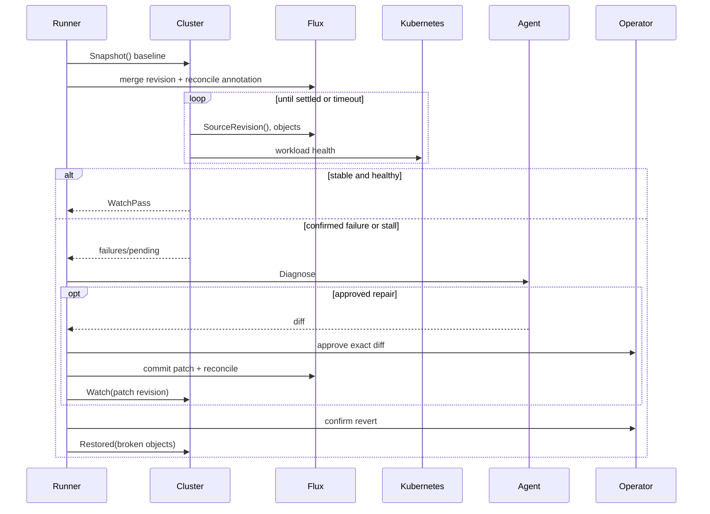
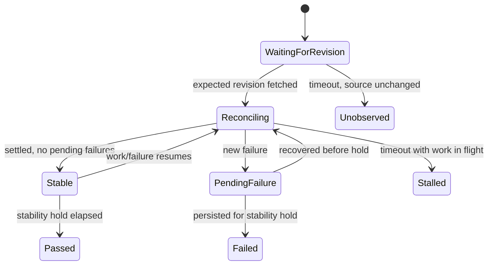

# Deep Dive: Cluster Observation and Repair

## Overview

The cluster subsystem proves whether a merged GitOps change reached Flux and remained healthy. It deliberately attributes only new or newly unsettled objects to the change: pre-existing churn is recorded in the baseline and is not a reason to undo a later merge. The runner owns merge, diagnosis, approved repair, and revert decisions; `cluster.Cluster` owns bounded observation.

See [Architecture Overview](../2. Architecture Overview.md) for the system boundary and [Workflow Overview](../3. Workflow Overview.md) for the end-to-end run.

## Responsibilities

- Snapshot Flux `Kustomization`/`HelmRelease` and Kubernetes workload health before a merge.
- Trigger an immediate Flux source reconciliation and wait for the expected commit revision.
- Distinguish a confirmed failure from work still reconciling, then require a stability hold before passing or failing.
- Diagnose failed or stalled watches, apply an operator-approved bounded patch, and re-watch its commit.
- Re-read broken objects before reverting and verify only those objects recover after the revert.

## Observation lifecycle

## Key files

- `internal/cluster/cluster.go`: baseline snapshots, revision-aware watch, persistent-failure and recovery windows.
- `internal/adapters/flux/reader.go`, `internal/adapters/flux/flux.go`: Flux API discovery, source revision, reconciliation trigger, and condition interpretation.
- `internal/adapters/kubernetes/health.go`: Deployment, StatefulSet, DaemonSet, pod, event, and log health evidence.
- `internal/run/run.go`: merge-to-watch handoff and watch-result handling.
- `internal/run/repair.go`: diagnosis, exact-diff approval, retry bounds, revert, and recovery handling.
- `internal/run/repair_test.go`, `internal/cluster/cluster_test.go`: repair and timing/attribution coverage.

## Implementation details

### Baseline attribution and revision confirmation

`Snapshot` combines Flux and workload objects into a map keyed by canonical object reference. During `Watch`, Flux must expose the merged SHA (prefix matching allows abbreviated revisions) before new failures can be blamed on the merge. Objects unhealthy or reconciling in the baseline are excluded from `newlyReconciling` and `HealthSnapshot.NewFailures` attribution.

Flux’s `Ready` condition is trusted only when it applies to the live generation. `Unknown`, dependencies waiting their turn, and unobserved generations are reconciling; a live `False` or `Stalled` condition is broken. Kubernetes workload readers apply the same conservative distinction to rollout progress and durable degradation.

### Settle and stability windows

`SettleTimeout` bounds waiting for Flux and the cluster. A new failure must persist for `StabilityHold`; transient readiness changes reset the failure clock. A healthy result likewise requires no attributable reconciliation and the whole stability hold. A timeout with work in flight is `WatchStalled`, not `WatchFail`; if Flux never moved from its first source revision, the watch errors because no observation can be attributed to this merge.

### Diagnosis, repair, and revert

`repair` sends only named failures and prior attempts to the agent. The agent may ask for one benign wait, propose a fix, or declare the update unfixable. Fixes require configured `fixes.allowedPaths`, a successful safe patch parse, and explicit operator approval; successful changes are committed with GitHub’s expected-head lock and watched as a new revision. Before any revert, `Broken` re-reads the named objects so recovered work is never discarded on stale evidence. `Restored` watches only objects the merge broke, avoiding unrelated continuous GitOps churn.

## Dependencies and interfaces

`cluster.Cluster` depends on two small read ports:

- `FluxReader`: Flux objects, source revision, and reconciliation annotation.
- `WorkloadReader`: workload objects plus pods, events, and logs for diagnosis.

`run.Observer` adds `Snapshot`, `Watch`, `Restored`, `Broken`, and a per-poll progress callback. The production composition supplies Flux and Kubernetes adapters; tests use scripted readers.

## Testing

- `internal/cluster/cluster_test.go` covers attribution, revision fetching, stable/pass/fail/stall classification, and recovery windows.
- `internal/adapters/flux/flux_test.go` covers current-generation condition semantics and controller edge cases.
- `internal/adapters/kubernetes/health_test.go` covers rollout state, pod lineage, truncated evidence, and event/log rendering.
- `internal/run/repair_test.go` covers benign waits, failed fixes, approval, repair re-watches, and revert safeguards.

## Potential improvements

- Persist watch poll telemetry for later timing analysis; current progress is narrative/event-oriented.
- Add an integration suite against a disposable Flux cluster for controller-version compatibility beyond adapter fakes.
