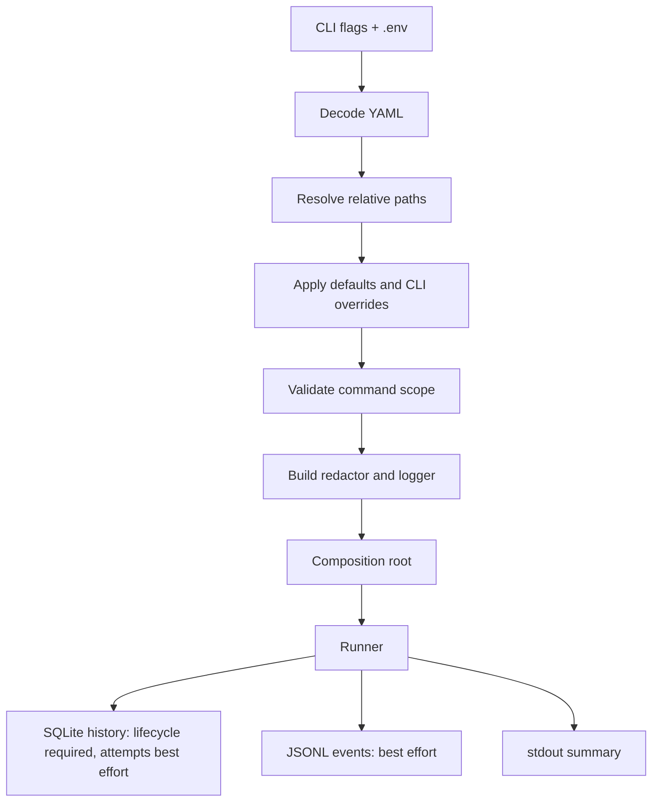
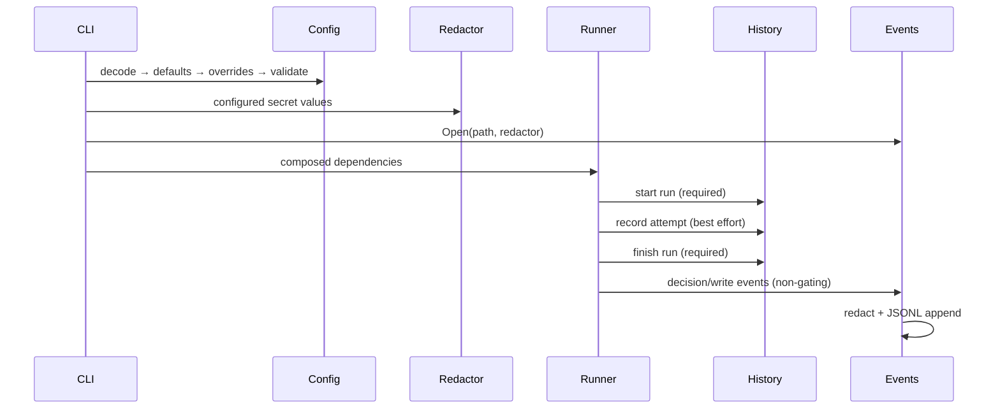

# Deep Dive: Configuration, History, and Events

## Overview

Configuration supplies the operator-controlled trust boundaries; the CLI turns it into a fully wired run; history and events make the result observable without becoming decision inputs. History availability still belongs to the run lifecycle: failing to start or finish the run record is fatal. Secrets are resolved only by configured environment-variable names and are redacted before diagnostics, persistent history, and JSON events.

See [Project Overview](../1. Project Overview.md) for setup and [Workflow Overview](../3. Workflow Overview.md) for command execution.

## Responsibilities

- Load one YAML document, resolve paths, apply defaults/overrides, and validate command-specific semantics.
- Build redaction before any operational component emits a message.
- Compose the run’s forge, agent, changelog, cluster, workspace, history, diagnostics, and event dependencies.
- Store the SQLite run lifecycle durably; treat an individual attempt-recording failure as best-effort so it does not revise the operational decision.
- Emit newline-delimited JSON events while work happens, safely and non-blockingly.

## Lifecycle

## Key files

- `internal/config/config.go`, `load.go`, `defaults.go`, `validate.go`: configuration model and single decode/default/validation pipeline.
- `internal/cli/prepare.go`, `root.go`, `run.go`: command parsing, `.env`, secret/redaction setup, composition invocation, `run`/`history` commands.
- `internal/composition/*`: production dependency wiring (see [Architecture Overview](../2. Architecture Overview.md)).
- `internal/history/history.go`: SQLite schema, migrations, writes, and retrieval.
- `internal/events/events.go`: JSON Lines emitter and event model.
- `internal/diagnostics/*`: redaction, safe storage normalization, logging, and prerequisite checks.

## Implementation details

### YAML configuration and validation

`config.Decode` selects `--config`, then `OPS_PILOT_CONFIG`, then `ops-pilot.yaml` in the working directory; it canonicalizes the file path, rejects multiple YAML documents and unknown fields, and resolves configured history/checkout paths relative to the configuration file. Defaults are applied once after decoding; command-line repository/log-level overrides are applied next; `Validate` is the sole semantic pass.

The `run` command validates bindings that can change production: a non-empty PR author/label filter, repository and Flux source, GitHub merge mode, AI provider/model/base URL, watch timing floor, changelog overrides, registry credentials, and permitted repair paths. `history` validates only what it reads plus universal logging/secret-name rules, so inspecting a local audit log does not require a live cluster or AI configuration.

### Secrets and diagnostics

`prepare` loads a local `.env` without overriding real environment variables, then builds one `diagnostics.Redactor` from the GitHub, AI, and registry secret values. All later logger, event, and stream construction receives that redactor. `ScrubSecrets` recognizes credential-shaped material the process did not explicitly load; `Storable` removes terminal-dangerous control data before persistence.

### Composition root

The Cobra `run` command prepares configuration, opens the optional event stream, selects an interactive terminal approver, and asks `composition.New` to construct the production ports. It then runs the workflow and prints a summary even when a later attempt failed. The command owns resource closure and translates domain error classes to stable process exit codes. `history` opens the same configured SQLite database and renders a table or JSON.

### SQLite history is observational but lifecycle-bound

`history.Store` creates a WAL-mode SQLite database with foreign keys and a bounded busy timeout. It records runs and ordered attempts, serializing structured breakage, fixes, and evidence as JSON. Forward migrations tolerate an already-present column. Starting and finishing the run record are lifecycle requirements and their failures stop the command. Recording an individual attempt is best-effort: the runner warns and continues, and encoding failures yield empty optional fields rather than changing the operational outcome. The durable decision remains the GitHub label/state, not a database row.

### JSON event stream

`events.Emitter` appends one JSON object per line with UTC timestamp, bound run ID, and repository. Events represent decisions and external writes—assessment, merge, diagnosis, fix, revert, labels, closure, and watch result—not terminal narration. The emitter locks writes, redacts prose fields and object reasons, and records its first write error before becoming a no-op. The runner reports that error at the end rather than allowing observability failure to interrupt an in-flight change.

## Interfaces

- `config.Loaded` carries the resolved config path, repository-relative config path, and `Config`.
- `history.Store` implements the runner’s `Recorder` port: `StartRun`, `RecordAttempt`, and `FinishRun`.
- `events.Emitter` implements the runner’s `Events` port: `Bind` and `Emit`; a nil emitter is safe.
- `cli.CommandDependencies` makes configuration, environment, streams, and prerequisite checks substitutable in command tests.

## Testing

- Config tests cover source precedence, symlink/path resolution, defaults, unknown fields, validation, and command-specific requirements.
- CLI tests cover `.env` precedence, redactor propagation, flags, exit codes, interactive detection, and history rendering.
- History tests cover schema migration, ordering, JSON round trips, and non-gating serialization failures.
- Event tests cover JSON shape, timestamp/run binding, write-failure behavior, secret redaction, and concurrent output safety.
- `internal/run/redaction_test.go` ensures every persisted/emitted narrative field is scrubbed at the workflow boundary.

## Potential improvements

- Add a configuration schema/reference generated from the Go structs to prevent manual drift.
- Add optional event-stream rotation; current semantics intentionally append to one operator-chosen file.
