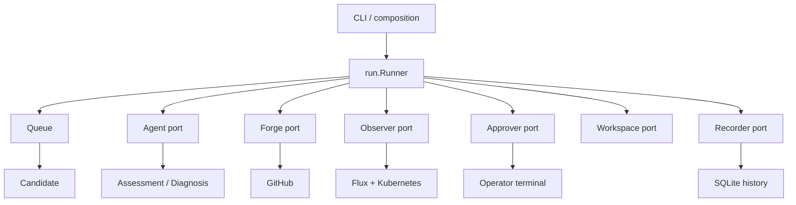
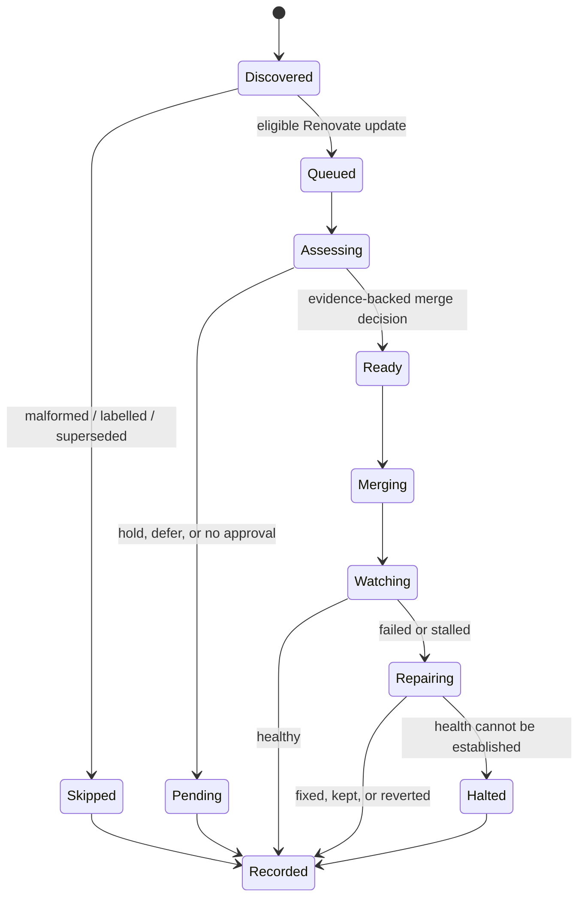

# Deep Dive: Run Orchestrator

## Overview

`internal/run` is the safety-critical coordinator for a single `ops-pilot run`. It owns workflow order and policy, but not infrastructure implementations: GitHub, Flux/Kubernetes, AI, history, terminal approval, and the local checkout are injected as ports. This makes the operational decisions testable without a live cluster.

The orchestrator starts from a list of Renovate pull requests and finishes each eligible one at one terminal verdict. A pull request that needs an operator is recorded as skipped and does not stop the rest of the queue. A merge whose cluster outcome cannot be re-read halts the whole run, because later updates could no longer be attributed to a known healthy baseline.

For the system boundaries, see the [Architecture Overview](../2.%20Architecture%20Overview.md); for the end-to-end paths, see the [Workflow Overview](../3.%20Workflow%20Overview.md). The AI judgement boundary is detailed in [AI Assessment and Interactive Chat](AI%20Assessment%20and%20Interactive%20Chat.md).

## Responsibilities

- Discover and classify Renovate pull requests into a deterministic queue.
- Record a durable `Run` and an `Attempt` for every considered candidate.
- Assemble assessment inputs, preserve operator clarification turns, and enforce runner-owned holds.
- Guard every repository write with the assessed head SHA and exact-diff approval.
- Merge exactly one approved update, reconcile Flux, and watch attributable workload health.
- Drive bounded repair, wait, keep, or revert handling after an unhealthy rollout.

## Architecture



`Runner` accepts these dependencies in `Dependencies`; `Options` supplies repository identity, filters, labels, merge method, allowed fix paths, retry budget, and mode flags. The runner contains no concrete GitHub or Kubernetes client. `Forge` is also the single port for external Git repository writes: merge, comment, label, close, and optimistic `CreateCommit`.

## Queue and Supersession

`Queue` parses Renovate update metadata and retains every discovered pull request as a `Candidate`, including skipped candidates. This is intentional: summaries can say why a PR was ignored rather than silently losing it. Existing reverted/declined labels are respected unless `--all` is set. Malformed Renovate bodies are skipped instead of guessed.

Supersession compares parsed dependency/version updates and touched repository paths. A candidate is considered superseded only when the evidence says a newer update replaced the same deployment. If changed-file lookup fails, it is excluded from supersession decisions rather than risking closure of a distinct deployment. In a non-dry run, a superseded PR is annotated and closed after its skipped attempt is recorded.



## Processing One Candidate

`Runner.Run` begins the history record, discovers candidates, attaches observation progress, and processes eligible candidates in queue order. `process` creates an in-memory `state` containing a `domain.Attempt`, then calls `decideCandidate`. The decision gate returns `merge` or `needs_approval`; only `merge` reaches `mergeAndWatch`. `--dry-run` creates a `would_merge` verdict at that same gate, with no external write.

```mermaid
sequenceDiagram
  participant R as Runner
  participant F as Forge / Workspace
  participant C as Changelogs
  participant A as Agent
  participant P as Approver
  participant O as Observer

  R->>F: sync PR head, changed files
  R->>C: resolve release notes
  R->>A: assess PR, dependency, evidence, paths
  alt clarify or conversational approval
    A-->>R: question / message
    R->>P: free-form clarification
    P-->>R: operator turn
    R->>F: re-read PR head
    R->>A: reassess with transcript
  end
  alt exact configuration diff
    R->>P: show exact diff; approve separately
    R->>F: optimistic commit to PR head
    R->>A: reassess fresh head and paths
  end
  alt evidence-backed safe
    R->>O: snapshot baseline
    R->>F: merge(expected head SHA)
    R->>O: reconcile and watch merge SHA
  else unresolved
    R-->>R: record pending/skipped attempt
  end
```

### Discovery and Assessment Inputs

Before assessment, the runner syncs the checkout to the PR head, resolves a changelog, and reads changed-file paths. A checkout failure does not stop discovery, but it adds a non-negotiable hold: the agent must not conclude from a different working tree. Major bumps, downgrades, missing release-note conditions, forged fences, and agent errors are similarly converted into holds. `hardHeld` clears model-provided questions and diffs where a runner-known safety fact cannot be discussed away.

### Interactive Decision Loop

`decideCandidate` is a loop, not a one-shot prompt. For `clarify`, or a non-hard `needs_approval` without a diff, it calls `Approver.Clarify` and appends an `ai.Clarification` containing the assistant message, question, and operator answer. It then re-reads the PR and refuses to reuse the conversation if the head moved. The next agent assessment receives the prior turns and can ask another focused question, defer, propose a diff, or produce evidence-backed `safe`.

An empty answer, `/skip`, or non-interactive execution leaves the PR pending. Text supplied to chat never itself authorizes a merge or write; it is only assessment context. The exact-diff path is independent: `applyAssessmentDiff` validates mode, writable PR head, allowed paths, and fix budget, then routes through the established `ApproveFix` prompt and patch application. After a successful optimistic commit, it refreshes the pull request, re-syncs the workspace, re-reads changed files, clears the chat transcript, and reassesses.

### Merge and Watch

`mergeAndWatch` snapshots the cluster before merging, reads the base branch head needed for a future revert, and confirms the PR head has not moved. `Forge.Merge` receives that expected head SHA, so both the pre-merge read and the host enforce the same optimistic-concurrency boundary. Once merged, the runner requests reconciliation and watches Flux/workload health against the baseline.

Only a healthy, settled pre-merge object is attributable to the update; objects absent from the baseline are also attributable. A pass completes the attempt. A failed or stalled watch enters the repair loop. A post-merge observation failure does not auto-revert: it records an error, leaves the merge in place, annotates the PR, and halts the run because the next attempt has no trustworthy baseline.

### Repair, Revert, and Attempt State

The repair loop asks the agent to classify a failure as a benign wait, an exact fix diff, or unfixable. A fix needs configured `fixes.allowedPaths`, a remaining fix budget, and separate operator approval. Each applied patch is an optimistic commit, followed by reconciliation and a new watch. Rejected/non-applying diffs consume the bounded budget but can be explained to the agent for a correction.

Before a revert, the runner re-reads unhealthy objects: a rollout that recovered while diagnosis ran is kept. Interactive operators can wait, keep, or explicitly revert; an unattended run uses the established revert behavior. A revert restores the recorded pre-merge branch content and applied fixes through an optimistic commit. If health cannot be established, the merge is left in place and the run halts rather than guessing.

`domain.Attempt` persists the decision and reason, assessed head, pre-merge/merge/revert SHAs, changelog and evidence, watch result, broken objects, diagnosis cause, applied diffs, fix attempts, wait usage, verdict, timing, and errors. `Recorder` is deliberately passive history: a history write failure is logged, not used as a decision gate.

## Ports and Interfaces

| Port | Role | Important safety boundary |
| --- | --- | --- |
| `Forge` | PR listing, reads, labels/comments, merge, branch/head lookup, commits | All GitHub writes and optimistic expected-head checks |
| `Observer` | baseline snapshots, reconcile, watch, re-read broken objects | Attributes health only against a known baseline |
| `Agent` | `Assess` and diagnosis requests | Advises through structured domain results; never writes directly |
| `Approver` | chat, exact-diff fix approval, revert choice, stream rendering | Operator chat cannot authorize writes |
| `Workspace` | local checkout synchronization | Assessment must not read an unrelated PR head |
| `Changelogs` | release-note resolution | Provides evidence, not a merge decision |
| `Recorder` / `Events` | durable history and live event stream | Observability only; not a decision gate |

## Testing

The run package uses fakes for every port and covers queue parsing/supersession, assessment holds, head movement, approval refusal, patch re-assessment, merge/watch outcomes, repair budgets, and revert behavior. `test/e2e/run_test.go` exercises assembled workflow scenarios. Race-focused coverage protects streamed interactive assessment and approval behavior. The test suite proves control flow and safety gates with fake GitHub/cluster services; it does not prove a live Flux deployment or GitHub API race.

## Bounded Potential Improvements

- Persist discussion transcripts only if operators need to resume a conversation across separate runs; current attempt history intentionally stores the conclusion, evidence, and applied diffs rather than chat text.
- Add a live staging integration test when a disposable Flux cluster and GitHub repository are available.
- Surface queue/supersession rationale in a machine-readable report if external scheduling systems need it; current events and attempt history already carry the decision.
